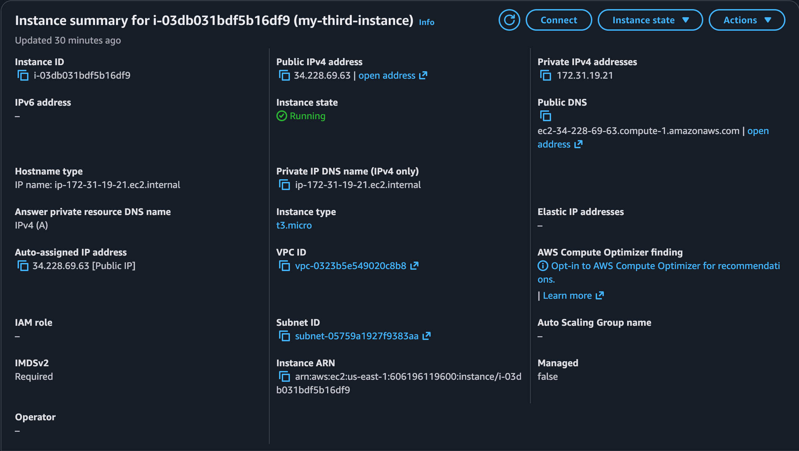

Static Website Deployment on AWS EC2 using Nginx

📌 Project Overview

This project demonstrates the deployment of a static website on an
Ubuntu-based Amazon EC2 instance using Nginx.

The project focuses on AWS EC2, Linux server administration,
network configuration, SSH access, Security Groups, and web server
configuration.

---

🎯 Objective

The objective of this project was to deploy a static website on
an AWS EC2 instance and make it accessible over the internet.

---

🏗️ Architecture

Architecture Flow

User → Internet → AWS EC2 → Ubuntu → Nginx → Static Website

---

☁️ AWS Services Used

- Amazon EC2
- Security Groups

🛠️ Technologies Used

- Ubuntu Linux
- Nginx
- HTML
- CSS
- JavaScript
- SSH

---

⚙️ Implementation

1. Created EC2 Instance

Created an Ubuntu-based Amazon EC2 instance to host the website.
2. Configured Security Group

Configured the Security Group to allow the required traffic:

- SSH – Port 22
- HTTP – Port 80
3. Connected to EC2

Connected to the Ubuntu EC2 instance using SSH.

4. Installed Nginx

Installed and configured Nginx as the web server.

5. Deployed Website

Copied the website files to the Nginx web directory.

6. Tested Deployment

Accessed the website using the EC2 public IP address and verified
that the website was working correctly.

---

📸 Screenshots

EC2 Instance

Security Group

Nginx Status

Deployed Website

---

🔐 Security Considerations

- Only required ports were opened.
- SSH access was restricted to my IP address where possible.
- AWS credentials and private keys were not stored in the repository.

---

📚 What I Learned

- Creating and managing EC2 instances
- Connecting to Linux servers using SSH
- Basic Linux server administration
- Installing and configuring Nginx
- Configuring AWS Security Groups
- Understanding HTTP and SSH ports
- Deploying a website on AWS
- Basic cloud troubleshooting

